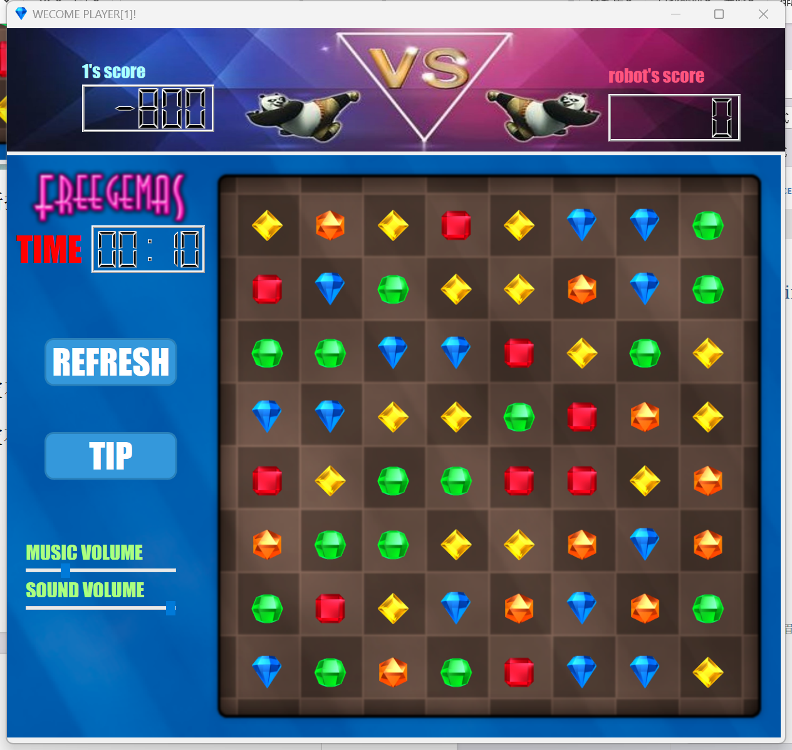
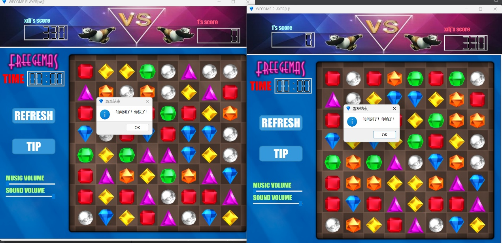
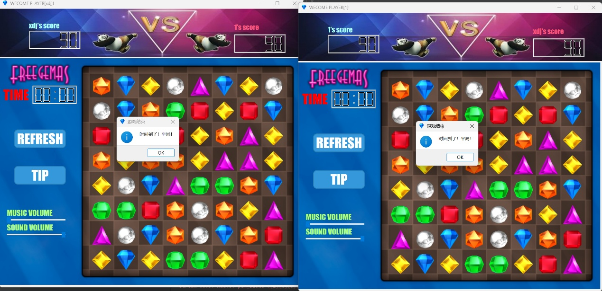

# Bejeweled-teamwork

大二上实训宝石迷阵小组项目，基于 Qt 6.7.2 和 C++17，包含客户端、服务端和 SQLite 用户数据。

## 功能

- 60 秒单机挑战：无需服务端即可开始，结束时显示本局得分。
- TCP 局域网联机对战、注册、登录、排行榜和对局记录。
- Qt Widgets 图形界面、宝石动画、音效和提示功能。

## 运行截图







截图来源于项目运行记录和用户手册，不代表所有机器的窗口尺寸。

## GitHub Release

第一版支持 Windows x64。下载 `Bejeweled-Windows-x64-portable.zip` 并解压：

- 双击 `Start_Host.cmd` 创建房间并启动本机客户端。
- 双击 `Join_Room.cmd` 输入主机 IPv4 地址加入局域网房间。
- 直接运行 `Bejeweled_Client.exe` 后点击 `Single Player` 可进行单机挑战。

发行包包含 Qt DLL、平台插件、SQLite 驱动、多媒体插件和 MinGW 运行库，最终用户无需安装 Qt 或 Qt Creator。联机使用 TCP `12345`，主机需允许 Windows 防火墙通过该端口。

## 从源码构建

需要 Qt `6.7.2` `win64_mingw`、MinGW 13.1.0 和 Python 3。Qt 缺失时运行：

```powershell
.\scripts\bootstrap-qt.ps1
```

构建并生成便携包：

```powershell
.\scripts\package-release.ps1
```

也可以双击仓库根目录的 `生成便携版.cmd`。不要直接运行 `build` 目录中的裸可执行文件，它们不包含 Qt 运行时。

## 目录

```text
Bejeweled_Client/ 客户端源码、界面和游戏资源
Bejeweled_Server/ 服务端源码、数据库和资源
scripts/          工具链恢复、启动和打包脚本
tests/            发布前检查脚本
docs/assets/      README 运行截图
```

## 许可证与资源来源

项目源代码采用 [MIT License](LICENSE)。项目中的部分图片、字体、音效和其他美术资源来源于网络，仅用于课程项目展示；它们不一定属于本项目作者，也不自动纳入 MIT 授权范围。再发布这些资源前，请核对原始来源的许可证、署名和商业使用条件。
